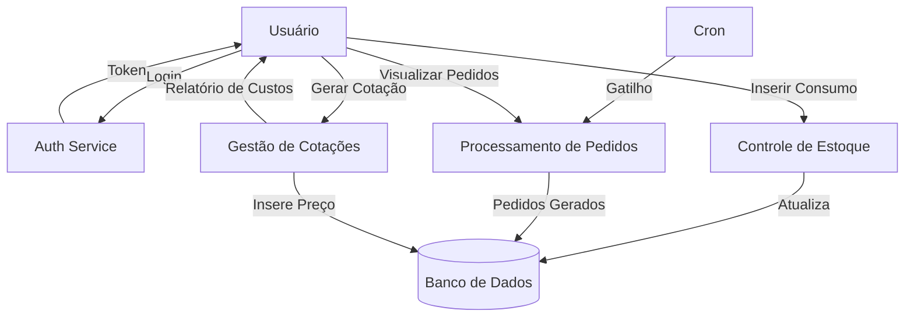
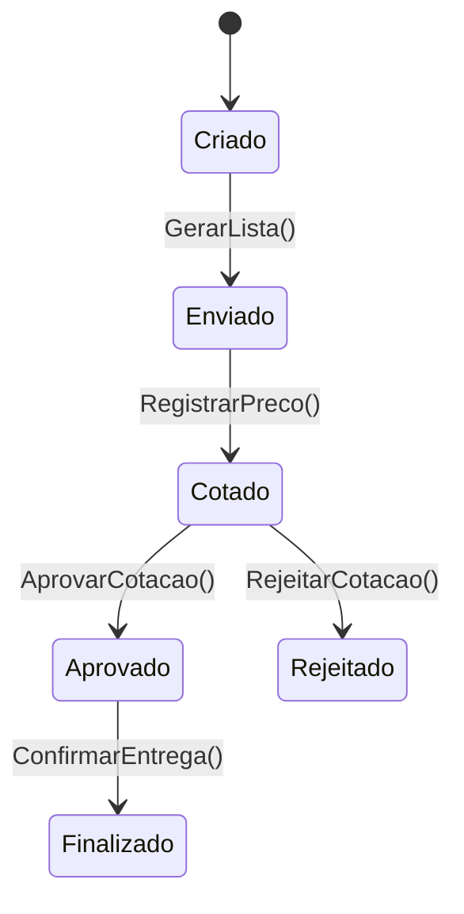

# Análise de Requisitos e Modelagem do Sistema “Kaizen Lists” Web App

## 1. Introdução  
Este documento apresenta a análise de requisitos, dicionário de dados, diagramas de fluxo de dados (DFD), diagrama de transição de estados (DTE) e descreve o ciclo de vida de desenvolvimento adotado (Ciclo Espiral Win-Win) para a plataforma web de gerenciamento de listas Kaizen.

***

## 2. Requisitos de Software

### 2.1. Requisitos Funcionais  
1. **RF01 – Cadastro de Itens**  
   - O sistema deve permitir criar, editar e remover itens com atributos: nome, unidade de medida e categoria.  
2. **RF02 – Cadastro de Áreas**  
   - O sistema deve permitir gerenciar áreas (ex.: Cozinha, Salão).  
3. **RF03 – Cadastro de Fornecedores**  
   - O sistema deve armazenar dados de fornecedores, incluindo contato e meio de envio.  
4. **RF04 – Registro de Estoque**  
   - Para cada item e área, registrar quantidade atual e estoque mínimo.  
5. **RF05 – Cálculo Automático de Pedidos**  
   - Gerar pedidos quando `EstoqueMínimo − QuantidadeAtual > 0`, vinculando item a fornecedor.  
6. **RF06 – Filtragem e Exportação de Pedido**  
   - Filtrar pedidos por fornecedor e exportar listas individuais (formato CSV ou PDF).  
7. **RF07 – Registro de Cotações**  
   - Inserir valores unitários e gerar cotação para cada pedido.  
8. **RF08 – Relatórios de Custos**  
   - Exibir totais por item, por fornecedor e global.  
9. **RF09 – Autenticação e Autorização**  
   - Módulo de login, perfis de usuário (administrador, colaborador).  
10. **RF10 – Histórico de Alterações**  
    - Auditar modificações de estoque e pedidos com timestamp e usuário responsável.

### 2.2. Requisitos Não Funcionais  
1. **RNF01 – Desempenho**  
   - Responder a requisições de consulta de listas em até 200 ms.  
2. **RNF02 – Escalabilidade**  
   - Suportar crescimento até 10 000 itens e 100 usuários simultâneos.  
3. **RNF03 – Disponibilidade**  
   - Disponibilidade de 99,5% anual.  
4. **RNF04 – Segurança**  
   - Criptografia de credenciais, tokens JWT, políticas de CORS.  
5. **RNF05 – Usabilidade**  
   - Interface responsiva, acessível (WCAG 2.1 nível AA).  
6. **RNF06 – Portabilidade**  
   - Compatível com browsers modernos (Chrome, Edge, Firefox).  
7. **RNF07 – Manutenibilidade**  
   - Arquitetura modular, testes automatizados (cobertura mínima de 80%).  
8. **RNF08 – Confiabilidade**  
   - Backup diário do banco de dados e logs de auditoria.

***

## 3. Dicionário de Dados  
| Entidade        | Atributo            | Tipo           | Descrição                                 |
|-----------------|---------------------|----------------|-------------------------------------------|
| Item            | ItemID              | UUID (PK)      | Identificador único do item               |
|                 | Nome                | String (100)   | Nome do produto                           |
|                 | UnidadeMedida       | String (20)    | Ex.: “kg”, “un”, “litro”                  |
| Área            | AreaID              | UUID (PK)      | Identificador da área                     |
|                 | Nome                | String (50)    | Ex.: “Cozinha”, “Salão”                   |
| Fornecedor      | FornecedorID        | UUID (PK)      | Identificador do fornecedor               |
|                 | Nome                | String (100)   | Razão social ou nome comercial            |
|                 | Contato             | String (100)   | Telefone ou e-mail                        |
|                 | MeioEnvio           | String (20)    | “WhatsApp”, “E-mail”                      |
| Estoque         | EstoqueID           | UUID (PK)      | Identificador do registro de estoque      |
|                 | ItemID              | UUID (FK)      | Referência a Item                         |
|                 | AreaID              | UUID (FK)      | Referência a Área                         |
|                 | QuantidadeAtual     | Decimal(10,2)  | Quantidade em estoque                     |
|                 | QuantidadeMinima    | Decimal(10,2)  | Estoque mínimo desejado                   |
| Pedido          | PedidoID            | UUID (PK)      | Identificador do pedido                   |
|                 | ItemID              | UUID (FK)      | Referência a Item                         |
|                 | FornecedorID        | UUID (FK)      | Referência a Fornecedor                   |
|                 | QuantidadeSolicitada| Decimal(10,2)  | Quantidade calculada para pedido          |
|                 | DataPedido          | DateTime       | Data/hora da geração do pedido            |
| Cotação         | CotacaoID           | UUID (PK)      | Identificador da cotação                  |
|                 | FornecedorID        | UUID (FK)      | Referência a Fornecedor                   |
|                 | DataCotacao         | DateTime       | Data de realização da cotação             |
| CotacaoItem     | CotacaoItemID       | UUID (PK)      | Identificador do item na cotação          |
|                 | CotacaoID           | UUID (FK)      | Referência a Cotação                      |
|                 | ItemID              | UUID (FK)      | Referência a Item                         |
|                 | Quantidade          | Decimal(10,2)  | Valor do pedido (ref. Pedido)             |
|                 | PrecoUnitario       | Decimal(10,4)  | Valor por unidade                         |
|                 | TotalItem           | Decimal(14,2)  | Derivado: Quantidade × PrecoUnitario      |

***

## 4. Diagrama de Fluxo de Dados (DFD) – Nível 1  

***

## 5. Diagrama de Transição de Estados (DTE) – Entidade “Pedido”  

***

## 6. Ciclo de Vida: Espiral Win-Win  
O projeto seguirá o **Ciclo Espiral Win-Win**, visando gerenciar riscos e alinhar expectativas entre stakeholders em cada iteração:

1. **Determinação de Objetivos**  
   - Definir metas de cada versão: cadastro, pedidos, cotações, relatórios.
2. **Avaliação de Alternativas e Restrições**  
   - Analisar tecnologias (backend Python/Flask, frontend React, PostgreSQL).
3. **Identificação e Resolução de Riscos**  
   - Segurança: autenticação JWT, criptografia TLS.  
   - Desempenho: índices em banco, caching de consultas.
4. **Planejamento da Iteração**  
   - Entregas incrementais a cada sprint de 2 semanas.
5. **Revisão com Stakeholders**  
   - Demonstrações de protótipo, feedback de usuários (cozinheiros, gerentes de salão).
6. **Próxima Espiral**  
   - Refinar requisitos, priorizar melhorias, planejar mitigação de novos riscos.

Cada espiral repete essas fases até o produto atingir todos os requisitos e metas de qualidade estabelecidas.